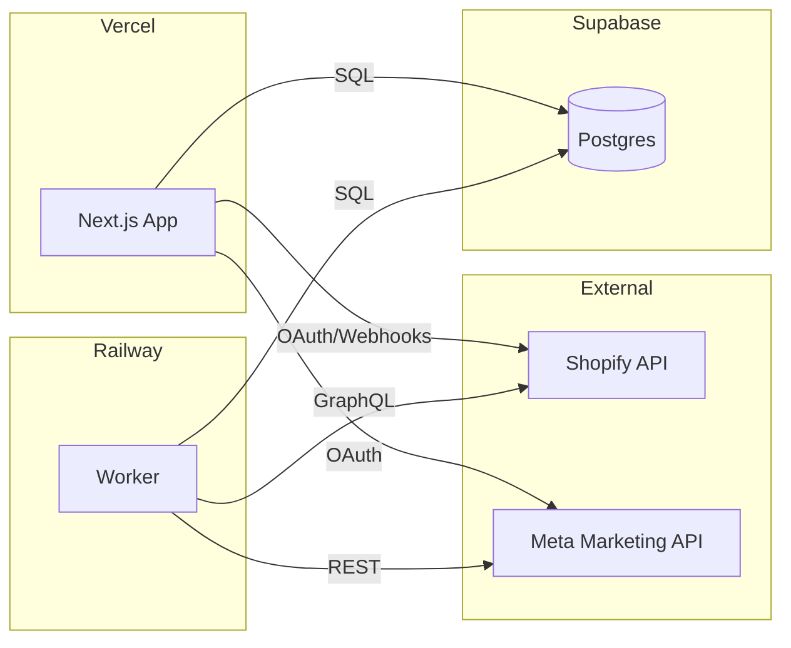
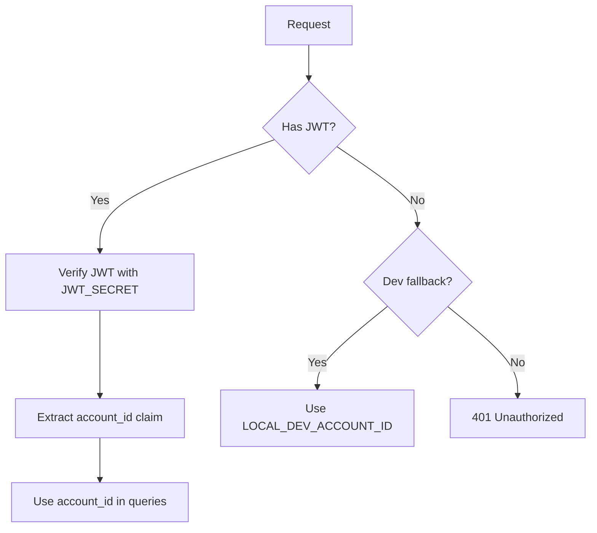
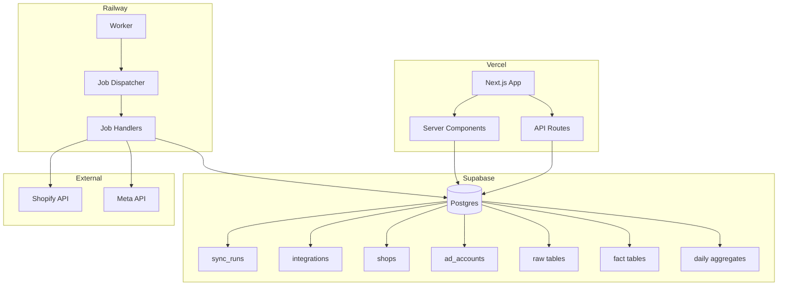
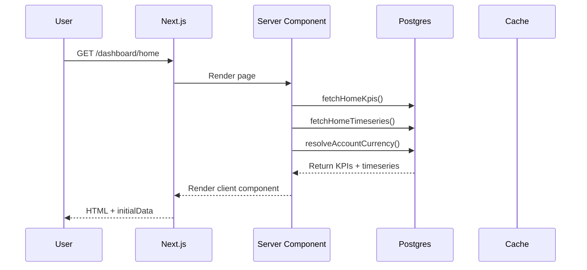
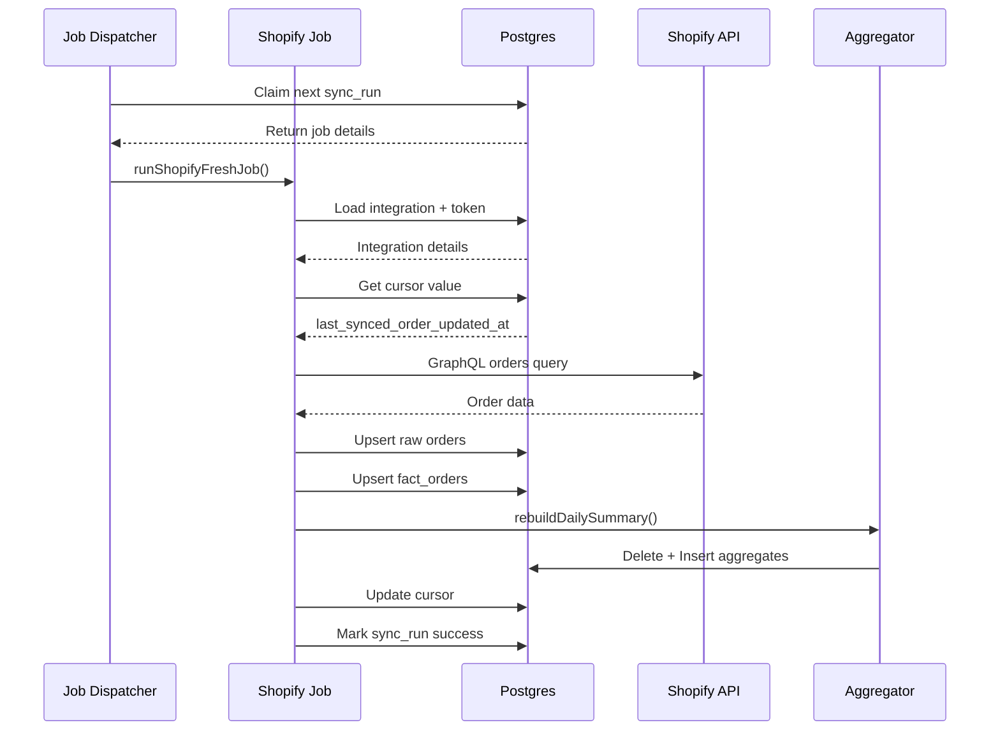

# Dashboard App - End-to-End Product & Engineering Audit

**Date:** 2026-01-29
**Auditor:** Kilo Code (Architect Mode)
**Scope:** Full codebase inventory, security review, correctness audit, refactor plan

**IMPORTANT NOTE:** Severity labels assume worst-case configurations. Downgrade any item to RISK if exploit conditions are not provable from code.

---

## A) Inferred Intent and Current Reality

### What This App Is (10 lines max)

An agency dashboard for e-commerce performance analytics. It connects to **Shopify stores** (orders, revenue) and **Meta ad accounts** (spend, ROAS) to provide unified reporting. The app is multi-tenant (account-based), warehouse-first (raw data stored in Postgres), with a Next.js frontend and a Node.js worker for data ingestion. Deployment targets (Vercel/Railway) are INFERENCE pending confirmation via repo config files. Phase 0 MVP appears to support one Shopify store + one Meta ad account per account (INFERENCE; verify via schema constraints and integration creation logic), with daily/weekly performance dashboards.

### Key User Personas and Jobs-to-be-Done

| Persona | JTBD | Evidence |
|---------|------|----------|
| Agency Owner | View consolidated performance across clients | [`HomeDashboardClient.tsx`](apps/web/src/app/(dashboard)/dashboard/home/HomeDashboardClient.tsx:1) shows MER, ROAS, AOV |
| Client (Shop Owner) | Track Shopify orders and revenue | [`ShopifyDashboardClient.tsx`](apps/web/src/app/(dashboard)/dashboard/shopify/ShopifyDashboardClient.tsx:1) shows orders, refunds, AOV |
| Media Buyer | Monitor Meta ad spend and ROAS | [`MetaDashboardClient.tsx`](apps/web/src/app/(dashboard)/dashboard/meta/MetaDashboardClient.tsx:1) shows spend, purchases, ROAS |
| Admin/Integrator | Connect/disconnect integrations, trigger manual syncs | [`SettingsClient.tsx`](apps/web/src/app/(dashboard)/settings/SettingsClient.tsx:1) shows integration management |

### Top 10 Core Flows

#### 1. Home Dashboard View
- **Entry Point:** `GET /dashboard/home` ([`page.tsx`](apps/web/src/app/(dashboard)/dashboard/home/page.tsx:70))
- **Dependencies:** [`daily_summary`](db/migrations/002_core_schema.sql:227) table, [`fetchHomeKpis`](apps/web/src/lib/data/home-dashboard.ts:99)
- **Outputs:** KPIs (revenue, spend, MER, ROAS, AOV, orders), timeseries chart
- **Failure Modes:** 
  - Silent: Empty data shows zeros ([`HomeDashboardClient.tsx`](apps/web/src/app/(dashboard)/dashboard/home/HomeDashboardClient.tsx:87))
  - Noisy: DB connection errors throw
- **Evidence:** [`home-dashboard.ts`](apps/web/src/lib/data/home-dashboard.ts:1)

#### 2. Shopify Dashboard View
- **Entry Point:** `GET /dashboard/shopify` ([`page.tsx`](apps/web/src/app/(dashboard)/dashboard/shopify/page.tsx:47))
- **Dependencies:** [`daily_shopify_metrics`](db/migrations/002_core_schema.sql:204), [`fact_orders`](db/migrations/002_core_schema.sql:161)
- **Outputs:** Shop summary, timeseries, recent orders
- **Failure Modes:** Shop not found throws error ([`shopify-dashboard.ts`](apps/web/src/lib/data/shopify-dashboard.ts:94))
- **Evidence:** [`shopify-dashboard.ts`](apps/web/src/lib/data/shopify-dashboard.ts:1)

#### 3. Meta Dashboard View
- **Entry Point:** `GET /dashboard/meta` ([`page.tsx`](apps/web/src/app/(dashboard)/dashboard/meta/page.tsx:46))
- **Dependencies:** [`daily_meta_metrics`](db/migrations/002_core_schema.sql:216), [`fact_meta_daily`](db/migrations/002_core_schema.sql:182)
- **Outputs:** Ad account summary, timeseries (spend, impressions, clicks, ROAS)
- **Failure Modes:** Ad account not found throws error
- **Evidence:** [`meta-dashboard.ts`](apps/web/src/lib/data/meta-dashboard.ts:1)

#### 4. Shopify OAuth Connect
- **Entry Point:** `GET /api/shopify/install` → `GET /api/shopify/callback`
- **Dependencies:** Shopify API, [`shops`](db/migrations/002_core_schema.sql:24), [`integrations`](db/migrations/002_core_schema.sql:53), [`integration_secrets`](db/migrations/002_core_schema.sql:67)
- **Outputs:** New integration record, triggers `shopify_7d_fill` job
- **Failure Modes:** 
  - HMAC verification failure ([`shopify.ts`](apps/web/src/lib/shopify.ts:100))
  - Currency mismatch (warns but proceeds) ([`callback/route.ts`](apps/web/src/app/api/shopify/callback/route.ts:51))
- **Evidence:** [`install/route.ts`](apps/web/src/app/api/shopify/install/route.ts:9), [`callback/route.ts`](apps/web/src/app/api/shopify/callback/route.ts:231)

#### 5. Shopify Order Webhook
- **Entry Point:** `POST /api/webhooks/shopify/[...topic]`
- **Dependencies:** [`shopify_webhooks_raw`](db/migrations/002_core_schema.sql:85)
- **Outputs:** Raw webhook stored (processing deferred to worker)
- **Failure Modes:** 
  - HMAC verification failure returns 401
  - DB timeout after 4s ([`route.ts`](apps/web/src/app/api/webhooks/shopify/[...topic]/route.ts:14))
- **Evidence:** [`[...topic]/route.ts`](apps/web/src/app/api/webhooks/shopify/[...topic]/route.ts:71)

#### 6. Manual Sync Trigger
- **Entry Point:** `POST /api/settings/manual-sync`
- **Dependencies:** [`sync_runs`](db/migrations/001_sync_runs.sql:6)
- **Outputs:** Queued sync_run record
- **Failure Modes:** Integration not found (404), type mismatch (400)
- **Evidence:** [`manual-sync/route.ts`](apps/web/src/app/api/settings/manual-sync/route.ts:35)

#### 7. Job Dispatcher (Worker)
- **Entry Point:** `startJobDispatcher()` in worker ([`job-dispatcher.ts`](apps/worker/src/job-dispatcher.ts:133))
- **Dependencies:** [`sync_runs`](db/migrations/001_sync_runs.sql:6), job handlers
- **Outputs:** Job execution, status updates
- **Failure Modes:** 
  - Unknown job type logs error and marks failed
  - Job exceptions caught and marked error
- **Evidence:** [`job-dispatcher.ts`](apps/worker/src/job-dispatcher.ts:1)

#### 8. Shopify 7-Day Fill Job
- **Entry Point:** `runShopifySevenDayFillJob` ([`shopify.ts`](apps/worker/src/jobs/shopify.ts:701))
- **Dependencies:** Shopify GraphQL API, [`shopify_orders_raw`](db/migrations/002_core_schema.sql:97), [`fact_orders`](db/migrations/002_core_schema.sql:161), [`daily_shopify_metrics`](db/migrations/002_core_schema.sql:204)
- **Outputs:** Orders upserted, aggregates rebuilt
- **Failure Modes:** Missing token, API errors, pagination edge cases
- **Evidence:** [`shopify.ts`](apps/worker/src/jobs/shopify.ts:701)

#### 9. Shopify Fresh Sync Job
- **Entry Point:** `runShopifyFreshJob` ([`shopify.ts`](apps/worker/src/jobs/shopify.ts:752))
- **Dependencies:** Cursor from [`sync_cursors`](db/migrations/002_core_schema.sql:76), Shopify API
- **Outputs:** Updated orders, advanced cursor
- **Failure Modes:** Cursor not advancing, API rate limits
- **Evidence:** [`shopify.ts`](apps/worker/src/jobs/shopify.ts:752)

#### 10. Meta Fresh Sync Job
- **Entry Point:** `runMetaFreshJob` ([`meta.ts`](apps/worker/src/jobs/meta.ts:864))
- **Dependencies:** Meta Insights API, [`meta_insights_raw`](db/migrations/002_core_schema.sql:134), [`fact_meta_daily`](db/migrations/002_core_schema.sql:182)
- **Outputs:** Insights upserted, aggregates rebuilt
- **Failure Modes:** Rate limiting (handled with backoff), stub mode returns fake data
- **Evidence:** [`meta.ts`](apps/worker/src/jobs/meta.ts:864)

---

## B) Spec Audit and Replacement Spec

### Existing Specs/Documents

| Document | Matches Code | Notes |
|----------|--------------|-------|
| [`PHASE0_01_OVERVIEW.md`](spec/PHASE0_01_OVERVIEW.md:1) | Partial | Out of scope section accurate; "Extensibility" claim not yet proven |
| [`PHASE0_02_STACK_INFRA.md`](spec/PHASE0_02_STACK_INFRA.md:1) | Partial | RLS mentioned but not implemented in migrations |
| [`PHASE0_03_SCHEMA_TENANCY_INTEGRATIONS.md`](spec/PHASE0_03_SCHEMA_TENANCY_INTEGRATIONS.md:1) | Yes | Schema matches migrations |
| [`PHASE0_05_JOBS_PIPELINE.md`](spec/PHASE0_05_JOBS_PIPELINE.md:1) | Partial | Job types match; "Bounded runtime" not enforced |
| [`PHASE0_07_SECURITY_RLS.md`](spec/PHASE0_07_SECURITY_RLS.md:1) | **No** | RLS policies documented but NOT implemented in DB |

### Spec vNext (Critical Gaps)

#### Domain Model Glossary

| Entity | ID Type | Invariants |
|--------|---------|------------|
| Account | UUID | Currency locked after first integration |
| User | UUID | Unique per account+email (case-insensitive) |
| Shop | UUID | Unique myshopify_domain (case-insensitive) |
| AdAccount | UUID | Unique platform+platform_ad_account_id |
| Integration | UUID | Type-specific FK (shop_id OR ad_account_id) |
| SyncRun | UUID | Status machine: queued→running→success/error |

#### System Boundaries and Integrations



#### Permissions Model (As-Is vs Should-Be)

**As-Is:**
- JWT-based auth with `account_id` claim
- No RLS policies in DB. Database role usage by web vs worker is UNKNOWN pending inspection of DB client initialization and connection strings.
- Tenant isolation via application-level WHERE clauses

**Should-Be:**
- RLS policies on all tenant tables
- Service role only for worker, anon/key auth for web
- Row-level tenant isolation enforced at DB layer

#### Data Lifecycle

| Data Type | Retention | Cleanup |
|-----------|-----------|---------|
| Raw orders | 90 days | Manual/archive job needed |
| Raw insights | 90 days | Manual/archive job needed |
| Webhooks | 30 days | Not implemented |
| Sync runs | 90 days | Not implemented |
| Aggregates (daily) | Forever | N/A |

#### Runtime Configuration

| Flag | Location | Purpose |
|------|----------|---------|
| `META_JOBS_ENABLED` | [`job-config.ts`](apps/web/src/lib/job-config.ts:7) | Toggle Meta sync jobs |
| `META_STUB_MODE` | [`meta.ts`](apps/worker/src/jobs/meta.ts:10) | Return fake Meta data |
| `SHOPIFY_API_VERSION` | [`shopify.ts`](apps/worker/src/jobs/shopify.ts:8) | API version override |

#### Non-Functional Requirements (Missing)

- **Latency:** No SLOs defined
- **Reliability:** No retry limits on jobs, no dead letter queue
- **Security:** No RLS; secrets storage encryption status is UNVERIFIED. Schema alone does not prove encryption or lack thereof; confirm via secret write/read paths.
- **Cost:** No query cost tracking, no rate limit budgets

#### Explicit Out-of-Scope (Current)

- Multi-currency reporting
- Product/customer-level analytics
- Additional sources (GA4, Klaviyo, TikTok, etc.)
- Real-time webhooks processing (only stored, not processed)

---

## C) Hard Core Findings (Prioritized)

### P0: Critical Issues

#### C1: No RLS - Tenant Isolation Risk
- **Impact:** RISK: Tenant isolation is not enforced at the database layer. Any missing tenant filter in application queries, any route that trusts tenant identifiers from request input, or any auth bypass would result in cross-tenant data exposure. EXPLOITABLE only if a full input → sink chain is proven.
- **Root Cause:** RLS policies documented but never implemented in migrations
- **Evidence:**
  - [`002_core_schema.sql`](db/migrations/002_core_schema.sql:1) - No CREATE POLICY statements
  - [`PHASE0_07_SECURITY_RLS.md`](spec/PHASE0_07_SECURITY_RLS.md:1) - Claims RLS exists
- **Minimal Fix:** Add RLS policies to all tenant tables
- **Ideal Fix:** Separate service_role (worker) and anon roles (web), enforce JWT-based RLS
- **Risk:** High - requires testing all queries with RLS context
- **Test Plan:** Verify each table returns only current tenant's data

#### C2: Secrets Storage Encryption Not Proven
- **Impact:** RISK: If secrets are stored unencrypted, a database breach would expose all API tokens. Confirm encryption behavior before classifying as P0.
- **Root Cause:** Database schema includes a column named value_encrypted, but encryption is NOT PROVEN without inspecting secret write/read paths.
- **Evidence:** [`002_core_schema.sql:69`](db/migrations/002_core_schema.sql:69)
- **Minimal Fix:** Add encryption at application layer
- **Ideal Fix:** Use Supabase Vault or external secrets manager
- **Risk:** Medium - migration needed for existing secrets

#### C3: Missing Input Validation on Webhooks
- **Impact:** Potential DoS via large payloads
- **Root Cause:** No size limits or schema validation on webhook payload
- **Evidence:** [`[...topic]/route.ts:56`](apps/web/src/app/api/webhooks/shopify/[...topic]/route.ts:56) - direct JSON parse
- **Minimal Fix:** Add payload size limit and basic schema check
- **Risk:** Medium. Shopify validation does not eliminate payload size abuse, retries, or topic misuse.

### P1: Reliability Issues

#### R1: No Job Timeout Enforcement
- **Impact:** Runaway jobs block queue indefinitely
- **Root Cause:** No timeout in job dispatcher or handlers
- **Evidence:** [`job-dispatcher.ts`](apps/worker/src/job-dispatcher.ts:133) - infinite loop with no timeout
- **Fix:** Add job-level timeout (60s) and heartbeat mechanism

#### R2: Cursor Race Condition in Shopify Fresh Job
- **Impact:** Duplicate order processing if job restarts mid-run
- **Root Cause:** Cursor updated after all orders processed, not per-batch
- **Evidence:** [`shopify.ts:769`](apps/worker/src/jobs/shopify.ts:769) - cursor update in callback after full fetch
- **Fix:** Update cursor incrementally or use idempotent upserts

#### R3: No Dead Letter Queue for Failed Jobs
- **Impact:** Failed jobs disappear after max retries (not implemented)
- **Root Cause:** No retry limit or DLQ mechanism
- **Evidence:** [`job-dispatcher.ts`](apps/worker/src/job-dispatcher.ts:1) - no retry logic
- **Fix:** Add retry_count check and DLQ table

#### R4: Meta Rate Limit Backoff Doesn't Account for Headers
- **Impact:** May hit rate limits despite backoff
- **Root Cause:** Backoff uses fixed delays, not X-Rate-Limit-Reset header
- **Evidence:** [`meta.ts:286`](apps/worker/src/jobs/meta.ts:286) - exponential backoff only
- **Fix:** Parse rate limit headers and wait until reset

### P2: Performance/Maintainability

#### M1: Extra DB Round Trips in Job Dispatcher
- **Impact:** One query per job to claim, separate to complete
- **Evidence:** [`job-dispatcher.ts:35`](apps/worker/src/job-dispatcher.ts:35) and [`job-dispatcher.ts:68`](apps/worker/src/job-dispatcher.ts:68)
- **Fix:** Batch status updates or use RETURNING

#### M2: Duplicate Date Parsing Logic
- **Impact:** 5+ copies of date parsing functions across codebase
- **Evidence:**
  - [`home-dashboard.ts:12`](apps/web/src/lib/data/home-dashboard.ts:12)
  - [`shopify-dashboard.ts:14`](apps/web/src/lib/data/shopify-dashboard.ts:14)
  - [`meta-dashboard.ts` (similar)]
- **Fix:** Centralize in `utils/time.ts`

#### M3: Index Verification Needed
- **Impact:** UNKNOWN performance impact on large datasets
- **Evidence:** UNKNOWN: Confirm indexes on fact_orders.integration_id and fact_meta_daily.integration_id by inspecting migration files. Current claims are inconsistent and must be verified against actual CREATE INDEX statements.
- **Fix:** Verify indexes exist; add if missing

---

## D) Security and Access Review

### AuthN/AuthZ Model (As Implemented)



**Critical Gap:** UNKNOWN: Verify whether account membership is validated beyond JWT claims by inspecting auth middleware and account lookup logic.

### Privilege Boundaries

| Layer | Access | Tenant Isolation |
|-------|--------|------------------|
| Web (Vercel) | JWT auth | Application-level WHERE clauses |
| Worker (Railway) | Database role privileges are UNVERIFIED pending inspection of DB connection configuration. | Application-level WHERE clauses |
| Database | No RLS | None - full access |

### Secrets Handling

| Secret | Location | Risk |
|--------|----------|------|
| Shopify tokens | `integration_secrets.value_encrypted` | **Plaintext** - High risk |
| Meta tokens | `integration_secrets.value_encrypted` | **Plaintext** - High risk |
| JWT_SECRET | Environment variable | Medium - standard practice |
| SHOPIFY_API_SECRET | Environment variable | Medium - standard practice |

### OWASP-Style Issues

| Issue | Location | Severity |
|-------|----------|----------|
| **Broken Access Control** | All API routes - no RLS | Critical |
| **Cryptographic Failure** | Plaintext secrets storage | Critical |
| **Injection** | SQL uses parameterized queries | Low |
| **Security Misconfiguration** | `META_STUB_MODE` can leak fake data | Low |
| **Logging** | Errors may leak stack traces | Low |

---

## E) Data and Schema Review

### Canonical Source of Truth Tables

| Domain | Source Table | Aggregates |
|--------|--------------|------------|
| Orders | `shopify_orders_raw` | `fact_orders`, `daily_shopify_metrics` |
| Meta Ads | `meta_insights_raw` | `fact_meta_daily`, `daily_meta_metrics` |
| Summary | N/A | `daily_summary` |

### Uniqueness Constraints and Indexes

**Correct:**
- `shops.myshopify_domain` - unique functional index
- `ad_accounts.(platform, platform_ad_account_id)` - unique
- `users.(account_id, email)` - unique (case-insensitive)

**Missing (Risky):**
- `fact_orders.integration_id, order_number` - has index but not UNIQUE
- `fact_meta_daily` FK indexes missing

### Migration Safety

| Migration | Safe? | Issue |
|-----------|-------|-------|
| `001_sync_runs.sql` | Yes | Simple table create |
| `002_core_schema.sql` | Partial | No IF NOT EXISTS on some indexes |
| `003_seed_data.sql` | **No** | Hardcoded UUIDs, no idempotency check beyond ON CONFLICT |

### Idempotency

| Write Path | Idempotent? | Evidence |
|------------|-------------|----------|
| Shopify OAuth | Yes | ON CONFLICT DO UPDATE |
| Order upsert | Yes | ON CONFLICT DO UPDATE |
| Meta insights | Yes | ON CONFLICT DO UPDATE |
| Sync runs | No | Plain INSERT only |

---

## F) Observability and Debuggability Review

### What You Can Debug Today

- Sync run status in [`sync_runs`](db/migrations/001_sync_runs.sql:6) table
- Error messages truncated to 1000 chars ([`job-dispatcher.ts:81`](apps/worker/src/job-dispatcher.ts:81))
- Basic health check at `/health` ([`index.ts`](apps/worker/src/index.ts:15))
- Worker uptime and DB connection status

### What's Missing

| Gap | Impact | Priority |
|-----|--------|----------|
| Correlation IDs | Cannot trace request across web→worker→API | P1 |
| Structured logging | Parsing logs is manual | P2 |
| Metrics (Prometheus/StatsD) | No visibility into performance | P2 |
| Alerting thresholds | Silent failures possible | P1 |
| Request tracing | No visibility into slow queries | P2 |

### Where Failures Are Swallowed

1. **Currency mismatch** - Warns but proceeds ([`callback/route.ts:51`](apps/web/src/app/api/shopify/callback/route.ts:51))
2. **Missing account in seed** - Returns empty array silently in some cases
3. **Meta stub mode** - Returns fake data without clear indication in UI

---

## G) Architecture and Maintainability

### Module Boundaries

```
apps/
├── web/           # Next.js - UI + API routes
│   ├── app/       # Routes + server components
│   ├── lib/       # Data access, auth, utils
│   └── components/# UI components
└── worker/        # Node.js - Job processor
    ├── jobs/      # Job implementations
    └── utils/     # Rate limiting, time
```

**Issues:**
- Date utilities duplicated across web and worker
- No shared package for common types/utils
- Auth logic split between `requireAccountId()` and `requireAccountIdFromRequest()`

### Duplicated Logic

| Logic | Locations |
|-------|-----------|
| Date parsing/formatting | 5+ files |
| Number clamping | [`home-dashboard.ts:38`](apps/web/src/lib/data/home-dashboard.ts:38), [`shopify-dashboard.ts:64`](apps/web/src/lib/data/shopify-dashboard.ts:64), etc. |
| API error class | Each route has its own |
| Range clamping | Dashboard data files |

### Dead Code

| Code | Evidence |
|------|----------|
| `reconciliation.ts` | References `fact_shopify_orders` which doesn't exist (should be `fact_orders`) |
| Legacy API routes | Marked "legacy" but no deprecation plan |
| `aggregate_update` job type | In schema but no handler |

### Coupling Issues

- UI directly imports from `lib/data/*` - no API layer abstraction
- Worker jobs directly call aggregate rebuild - no queue separation
- Database schema changes require coordinated web+worker deploys

---

## H) Test Strategy Upgrade

### Current State

**No tests found in codebase.**

### Minimal High-Value Test Additions

| Test Type | Coverage | Priority |
|-----------|----------|----------|
| Unit | Date utility functions | P2 |
| Unit | Number clamping/parsing | P2 |
| Integration | Auth middleware | P1 |
| Integration | Job dispatcher claim/complete cycle | P1 |
| Integration | Shopify OAuth flow | P1 |
| E2E | Dashboard data loading | P2 |

### Fixtures Needed

- Test account with known UUID
- Test shop with mock Shopify data
- Test ad account with mock Meta data
- Mock Shopify/Meta API responses

### What Must Be Mocked vs Real

| Component | Strategy |
|-----------|----------|
| Shopify API | Mock (use MSW or nock) |
| Meta API | Mock (use MSW or nock) |
| Database | Real (testcontainers or ephemeral Supabase) |
| Redis/Queue | N/A - uses Postgres |

---

## I) Diagrams

### Component Diagram



### Data Flow: Home Dashboard Request



### Data Flow: Shopify Sync Job



---

## J) Aggressive Refactor Plan

### Target Architecture

```
packages/
├── shared/          # Shared types, utils
│   ├── types/       # Domain types
│   ├── utils/       # Date, number, validation
│   └── schemas/     # Zod schemas
├── db/              # Database client + migrations
│   ├── migrations/
│   └── client.ts
├── auth/            # Auth utilities
│   ├── jwt.ts
│   └── rls.ts
apps/
├── web/             # Next.js (thinner)
├── worker/          # Job processor
└── scheduler/       # Cron trigger (optional)
```

### Deletion/Consolidation Items

| Item | Action | Proof of Safety | Replacement |
|------|--------|-----------------|-------------|
| `apps/web/src/app/api/dashboard/*` | Delete | Server components in `(dashboard)` replace them | Use server components only |
| `reconciliation.ts` | Delete | References non-existent `fact_shopify_orders` table | Fix or remove |
| Duplicate date utils | Consolidate | 5+ identical functions | `packages/shared/utils/time.ts` |
| `job-config.ts` | Merge | Only used for Meta flags | Move to `shared/config` |
| `sync-runs.ts` | Merge | Only has `enqueueMetaInitialFill` | Move to `shared/jobs` |

### Step-by-Step Commit Plan

#### Commit 1: Mechanical Renames + Formatting
- Rename inconsistent variables (`sync_run_id` → `syncRunId` in TS only)
- Add consistent import ordering
- No functional changes

#### Commit 2: Delete Dead Code + Unused Flags
- Remove legacy API routes (marked in comments)
- Remove `reconciliation.ts` or fix it
- Remove unused imports

#### Commit 3: Consolidate Duplicate Modules
- Create `packages/shared`
- Move date utilities
- Move number utilities
- Update imports in web and worker

#### Commit 4: Add RLS Policies
- Add `CREATE POLICY` statements to migrations
- Test with web app
- Verify worker still functions with service_role

#### Commit 5: Tighten AuthZ/Tenant Boundaries
- Add middleware to verify account access
- Remove dev fallback in production
- Add account membership check

#### Commit 6: Add Missing Tests
- Unit tests for shared utils
- Integration tests for auth
- Integration tests for job dispatcher

#### Commit 7: Performance and Observability
- Add correlation IDs
- Add structured logging (Pino)
- Add metrics endpoint

---

## K) Canonical Vocabulary

| Current Messy Name | Canonical Name | Location |
|-------------------|----------------|----------|
| `myshopify_domain` | `shopDomain` | Code, DB, API |
| `platform_ad_account_id` | `adAccountId` | Code, DB, API |
| `sync_run_id` | `syncRunId` | Code (TS), keep `sync_run_id` in DB |
| `integration_id` | `integrationId` | Code (TS), keep `integration_id` in DB |
| `shopify_offline_token` | `shopifyAccessToken` | Code, DB |
| `meta_access_token` | `metaAccessToken` | Code, DB |
| `value_encrypted` | `encryptedValue` | Code, DB |
| `fact_orders` | `orders` | Consider rename |
| `fact_meta_daily` | `metaDailyMetrics` | Consider rename |

---

## L) "Genius Standard" Checklist

- [ ] Single source of truth per domain concept
- [ ] No duplicated flows (date parsing, number clamping)
- [ ] No ambiguous naming (consistent camelCase in TS, snake_case in SQL)
- [ ] No dead flags (remove META_STUB_MODE if not needed)
- [ ] Explicit error handling (no silent failures)
- [ ] Reproducible local dev and deterministic builds
- [ ] Tests cover all P0/P1 findings
- [ ] Observability makes failures obvious
- [ ] RLS policies enforce tenant isolation
- [ ] Secrets encrypted at rest
- [ ] All FK columns indexed
- [ ] Job timeouts enforced
- [ ] Correlation IDs across all requests

---

## Known Unknowns

| Question | What Would Answer It |
|----------|---------------------|
| Is Meta OAuth flow implemented? | Search for `/api/meta/connect` or similar - not found in inventory |
| How are webhooks processed after storage? | No code found that processes `shopify_webhooks_raw` table |
| What is the actual production deployment status? | Railway/Vercel deployment logs |
| Are there any existing tests not in repo? | Check CI config, ask team |
| What is the actual data volume? | Query production DB for row counts |
| Is there a meta-connect UI flow? | Check settings page more thoroughly |

---

## Summary

This codebase is a functional Phase 0 MVP with significant security and maintainability debt. The most critical issues are:

1. **No RLS** - Database does not enforce tenant isolation; application-level bugs could lead to cross-tenant access (P0 risk).
2. **Secrets encryption not proven** - Verify secret write/read paths to confirm at-rest encryption (P0 if unencrypted).
3. **No tests** - Zero automated test coverage
4. **Duplicated logic** - 5+ copies of date/number utilities
5. **Missing observability** - No correlation IDs, metrics, or structured logging

The refactor plan prioritizes security fixes first (RLS, encryption verification), then maintainability (consolidation, tests), then observability.
